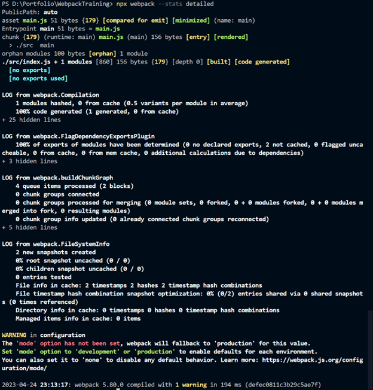

# Webpack Review

## Generate package.json and install Webpack

`npm init -y`

`npm install webpack webpack-cli --save-dev`

#### Run webpack using the default configuration

`npx webpack`

#### Provides detailed information around the build process

`npx webpack --stats detailed`



## Custom Configuration

#### Minimal config

```js
const path = require("path"); //Cannot use ECMA script modules in this file

module.exports = {
  entry: "./src/index.js",
  output: {
    filename: "bundle.js",
    path: path.resolve(__dirname, "./dist"),
  },
  mode: "none",
};
```

## Add scripts for convenience to package.json

```json
...
"scripts": {
    "build":"webpack"
  }
...
```

## Webpack Rules

#### These tell webpack how to handle various file types. There are four types of asset module types:

- asset/resources - Used to export large images or large fonts. Generates a new file in the output folder for each resource
- asset/inline - Inline file into the bundle as data URI. Useful for exporting Svgs. Does not generate output file. Key difference between asset/resource and asset/inline is asset resource generates a separate file for each image. This results in multiple http requests as opposed to a larger bundle.
- asset/source - Source code of the file as dist and into JS file as string of text
- asset - Webpack will choose as required. File < 8kb = asset/inline > asset/resource

##  Loaders

#### When using loaders we must install them separately as npm packages

```js
...
    {
        test:/\.css$/,
        use:[
                'style-loader',
                'css-loader'
            ]
    }
...
```

```npm install css-loader style-loader --save-dev```

### Using sass
```js
...
    {
        test:/\.scss$/,
        use:[ // Webpack process loaders from right to left. Order matters
                'style-loader','css-loader','sass-loader'
            ]
    }
...
```
```npm install sass-loader sass --save-dev ```


## Plugins
All webpack should be saved with ```--save-dev``` as these are development dependencies
```npm install mini-css-extract-plugin --save-dev```

With Webpack 5 or greater we can use `clean:true` instead of `clean-webpack-plugin`
- 1. `output.clean` supports only 2 sub-options (dry and keep), while `clean-webpack-plugin` supports much more options. 

- 2. `output.clean` option does not clean the output directory when running `webpack-dev-server` with `writeToDisk: true`. However, `clean-webpack-plugin` does.

#### [Webpack Plugins](https://webpack.js.org/plugins/)
#### [Webpack Modes](https://webpack.js.org/configuration/mode/)
#### [HTMLWebpackPlugin](https://github.com/jantimon/html-webpack-plugin)